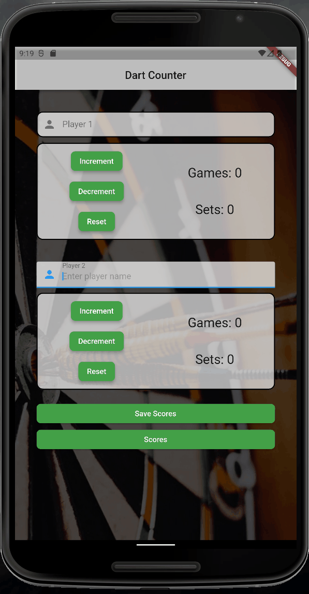

# Welcome

#### In this dart_counter app you will find a simple solution to count sets beetween two players. 

---
### Language used in procejt:
- Flutter
- Dart

---

### Short info:
- It is my first app so propably there will be some mistakes. 

- Below is quick look on my app: 

---

Thank you for your attention :)
